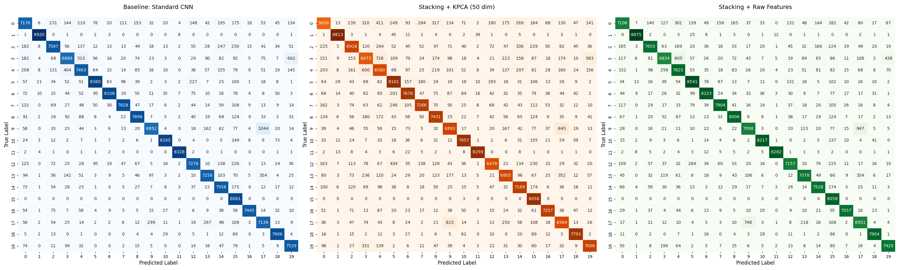

# Robust Font Classification using Hybrid Deep Kernel Ensembles

This repository contains the implementation of a multi-stage deep learning and ensemble pipeline designed to classify visually similar fonts from the **UCI Character Font Images** dataset.

## 1. Introduction

Fine-grained font classification is challenging due to subtle visual differences and high intra-class variance from scanning artifacts. This project implements a three-stage methodology:

1.  **Convolutional Neural Network (CNN)** enhanced with **Spatial Attention** for noise-robust feature extraction.
2.  **Kernel Principal Component Analysis (kPCA)** for non-linear dimensionality reduction.
3.  **Stacking Ensemble** of heterogeneous classifiers (Random Forest, MLP, and XGBoost).

Our **Stacking Ensemble applied to raw deep features** achieved a peak performance of **91.10% accuracy** and a **0.9115 F1-score**, significantly outperforming kernel-based reduction methods.

---

## 2. Architecture Overview

The project follows a hierarchical approach where features are progressively refined:

1.  **Feature Extraction:** A CNN with Spatial Attention Modules that focus on specific glyph artifacts like serifs.
2.  **Transformation Workflows:**
    - **Workflow A (kPCA):** Projecting latent features into a higher-dimensional RKHS.
    - **Workflow B (Raw):** Using raw 256-dimensional latent vectors directly.
3.  **Classification:** A Stacking Generalization ensemble using a Logistic Regression meta-learner to aggregate predictions.

---

## 3. Dataset Specifications

We utilized a curated subset of the UCI Character Font Images dataset focusing on the most frequent font families to ensure robust learning.

| Property          | Value                                        |
| :---------------- | :------------------------------------------- |
| **Observations**  | 562,835                                      |
| **Features**      | 400 pixels ($20 \times 20$ grayscale)        |
| **Classes**       | Top 20 Font Families                         |
| **Distribution**  | Imbalanced ($\approx 10:1$ ratio)            |
| **Preprocessing** | Min-Max Scaling [0, 1], Stratified 5-fold CV |

---

## 4. Key Results

The experimental results highlight a clear hierarchy in strategy effectiveness. While kPCA offered computational speedups, preserving the high-dimensional raw latent variance was critical for distinguishing fine-grained structures.

### 5. Performance Comparison (5-fold CV)

| Method                    |  Accuracy  |  F1-Score  |    AUC     | Total Time (s) |
| :------------------------ | :--------: | :--------: | :--------: | :------------: |
| Workflow A (kPCA)         |   0.8534   |   0.8536   |   0.9899   |     1026.2     |
| **Workflow B (Raw Data)** | **0.9110** | **0.9115** | **0.9954** |   **1161.4**   |

### 6. Final Model Generalization

Testing the **Workflow B** model on a separate held-out test set ($N \approx 56,000$):

- **Test Accuracy:** 89.15%
- **Macro-F1 Score:** 89.23%
- **AUC:** 0.9921

---

## 7. Key Findings & Discussion

- **Information Preservation:** Compressing features via kPCA resulted in a ~5.7% performance drop. The "intrinsic dimensionality" of font style is high; small details like serif sharpness are lost during heavy dimensionality reduction.
- **Ensemble Synergy:** The Random Forest component provided the strongest contribution (~55%) to the meta-learner, proving that "hard-cut" decision boundaries effectively correct the marginal errors of neural networks.
- **Attention Utility:** Spatial attention was crucial for suppressing background scanning noise and focusing on discriminative glyph features.

---
